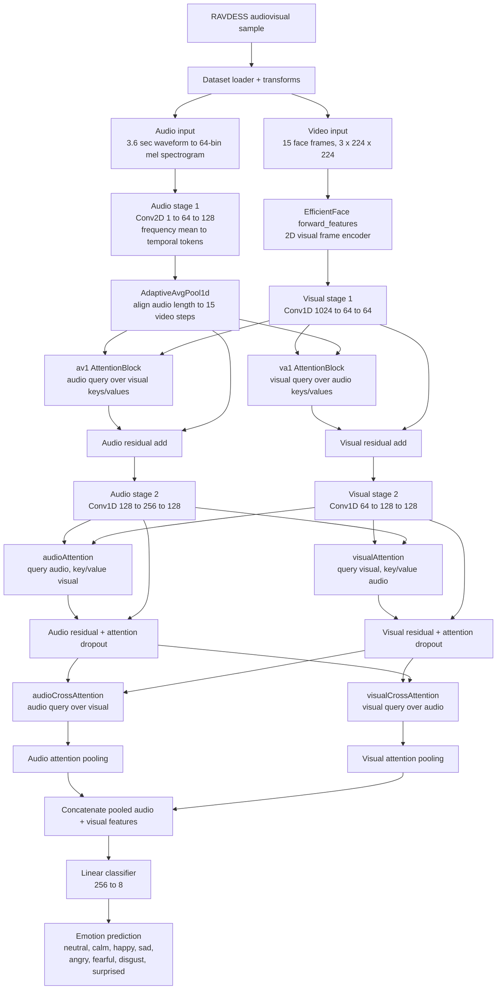
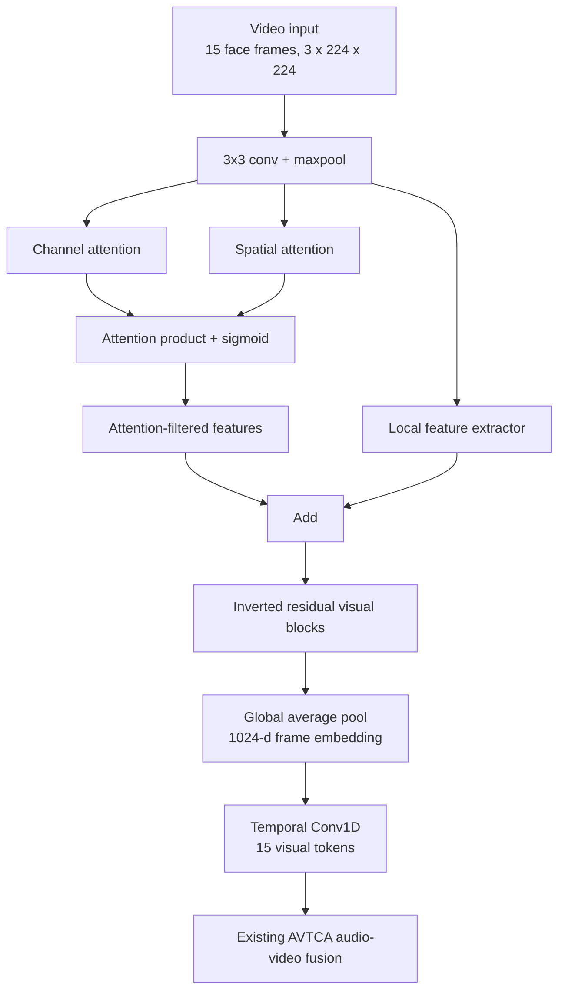

# Current Architecture: RAVDESS Best Verified Model

This file documents the best verified RAVDESS architecture and the V4 visual-backbone experiment.

## Best Checkpoint

| Item | Value |
|---|---|
| Result folder | `results/v3_01_baseline_mel_h4` |
| Checkpoint | `RAVDESS_multimodal_cnn_15_best.pth` |
| Model path | `MultiModalCNN.forward_feature_3` in `models/multimodal_cnn.py` |
| Dataset | RAVDESS, 8 emotion classes |
| Audio feature | Mel spectrogram |
| Fusion | `it` |
| Attention heads | 4 |
| SpecAugment | Off |
| Audio channel gate | Off |
| Best validation accuracy | 82.9167% at epoch 40 |
| Test accuracy | 81.8750% on 480 held-out test samples |

This remains the best overall model after the V4 `attention_local` experiments. The V4 branch reduced final training accuracy, but it did not beat this checkpoint on validation or held-out test accuracy.

## Best V4 Attention-Local Checkpoint

| Item | Value |
|---|---|
| Result folder | `results/v4_05_attention_local_pretrain_h4_lr001` |
| Checkpoint | `RAVDESS_multimodal_cnn_15_best.pth` |
| Visual backbone | `AttentionLocalVisualTemporal` via `--visual_backbone attention_local` |
| Pretrain | Compatible partial load from `pretrained/EfficientFace_Trained_on_AffectNet7.pth` |
| Best validation accuracy | 79.7917% |
| Test accuracy | 79.7917% on 480 held-out test samples |
| Final train accuracy | 93.8151% |

V4 is useful as an overfitting study: it lowers train accuracy compared with EfficientFace, but it also lowers test accuracy. Therefore the production/best-model diagram below still uses the V3 EfficientFace baseline.

## Architecture Diagram

## Code Mapping

| Diagram section | Code location |
|---|---|
| RAVDESS loader, train/val/test split | `datasets/ravdess.py` |
| Video frame loading and transforms | `datasets/ravdess.py`, `src/data/transforms.py` |
| Audio crop/pad and mel extraction | `datasets/ravdess.py` |
| EfficientFace visual encoder | `models/multimodal_cnn.py`, `models/efficient_face.py`, `models/modulator.py` |
| V4 attention-local visual encoder | `AttentionLocalVisualTemporal` in `models/multimodal_cnn.py` |
| Audio CNN stages | `AudioCNNPool` in `models/multimodal_cnn.py` |
| Audio temporal alignment | `self.audio_temporal_pool` in `MultiModalCNN.__init__` |
| Intermediate `av1` / `va1` attention | `forward_feature_3` in `models/multimodal_cnn.py` |
| Cross-modal `audioAttention` / `visualAttention` | `forward_feature_3` in `models/multimodal_cnn.py` |
| Final `audioCrossAttention` / `visualCrossAttention` | `forward_feature_3` in `models/multimodal_cnn.py` |
| Attention pooling | `AttentionPool` in `models/multimodal_cnn.py` |
| 8-class classifier | `classifier_1` in `models/multimodal_cnn.py` |

## Paper Mapping

| Architecture section | Paper/source | What was taken |
|---|---|---|
| Overall two-stream audio/video design | AVTCA | Separate audio and visual encoders before fusion. |
| Bidirectional cross-modal agreement | AVTCA | Audio attends to visual tokens and visual attends to audio tokens. |
| Intermediate and final cross-attention blocks | AVTCA | The `av1` / `va1` stage and final `audioCrossAttention` / `visualCrossAttention` stage. |
| EfficientFace visual backbone with channel/spatial/local feature refinement | AVTCA / EfficientFace components used by the AVTCA implementation | Face-frame feature extraction before temporal modeling. |
| Audio CNN over mel features | AVTCA-style audio branch | Spectrogram-like audio features encoded with convolutional layers. |
| Residual paths around attention | Transformer/AVTCA design pattern | Preserve unimodal information while adding cross-modal information. |
| Adaptive audio-video temporal alignment | Codebase fix, not directly copied from a paper | Aligns audio tokens to the 15-frame visual sequence before intermediate attention. |
| Cross-modal MHA in `audioAttention` / `visualAttention` | Codebase correction of the intended AVTCA behavior | Uses audio as query over visual and visual as query over audio, instead of self-attention. |
| Attention pooling | Codebase improvement over the original max-pooling implementation | Learns which time steps matter instead of taking only the max activation. |
| SpecAugment | SpecAugment paper, tested as an ablation only | Training-time audio augmentation; not part of the winning architecture. |
| TemporalChannelGate | Squeeze-and-excitation / AVTCA channel-attention idea, tested as an ablation only | Optional audio channel recalibration; not part of the winning architecture. |
| Attention-local visual backbone | Codebase V4 experiment inspired by channel/spatial/local visual processing | Lighter visual extractor intended to reduce EfficientFace memorization; did not beat the V3 baseline. |

## V3 Test Result Summary

| Run | Best validation | Test top-1 |
|---|---:|---:|
| `v3_01_baseline_mel_h4` | 82.9167% | 81.8750% |
| `v3_02_specaugment_mel_h4` | 80.0000% | 79.3750% |
| `v3_03_audio_channel_gate_mel_h4` | 81.6667% | 76.8750% |
| `v3_04_specaugment_audio_gate_mel_h4` | 81.6667% | 68.9583% |

Conclusion: the best current architecture is the baseline mel + 4-head AVTCA model without SpecAugment and without the audio channel gate.

## V4 Test Result Summary

| Run | Visual backbone | Pretrain | Learning rate | Best validation | Test top-1 | Final train |
|---|---|---:|---:|---:|---:|---:|
| `v4_05_attention_local_pretrain_h4_lr001` | `attention_local` | yes | 0.010 | 79.7917% | 79.7917% | 93.8151% |
| `v4_06_attention_local_scratch_h4_lr001` | `attention_local` | no | 0.010 | 78.1250% | 73.1250% | 92.5781% |
| `v4_07_attention_local_scratch_h4_lr005` | `attention_local` | no | 0.005 | 79.3750% | 77.9167% | 90.8984% |

The best V4 run is `v4_05_attention_local_pretrain_h4_lr001`. It reduced the final train accuracy compared with V3, but it was 2.0833 percentage points below `v3_01_baseline_mel_h4` on held-out test accuracy.

## V4 Visual Backbone

`AttentionLocalVisualTemporal` keeps the same interface as `EfficientFaceTemporal`, so the AVTCA fusion path can switch visual extractors using `--visual_backbone attention_local`.

The V4 idea was to force visual learning through explicit channel, spatial, and local-region processing instead of relying entirely on the stronger EfficientFace path. The result suggests that EfficientFace is not the only source of overfitting: the smaller V4 visual branch still overfit, though less severely, and did not improve the final held-out test result.
